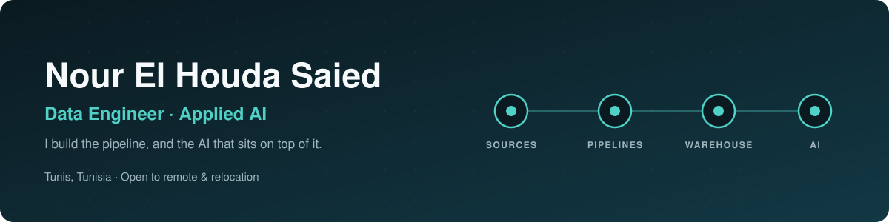
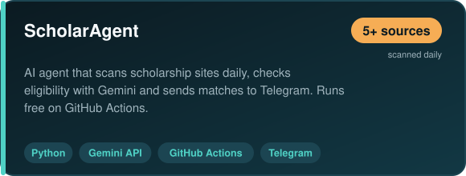
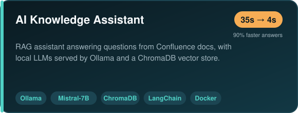
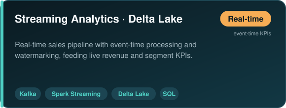
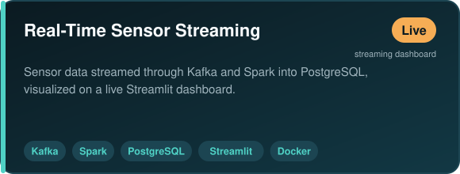
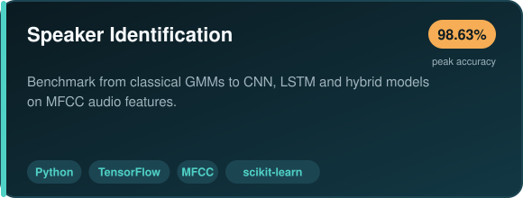
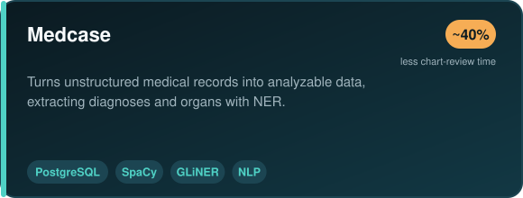
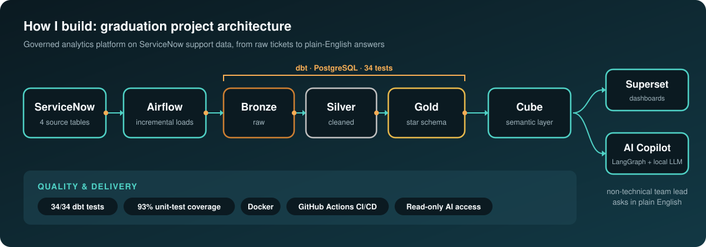
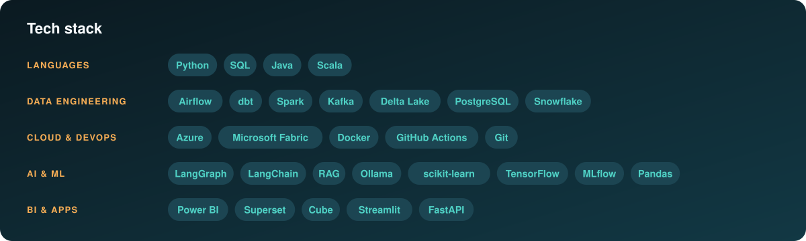

  

  
  
  

### 👋 About me

- 🛠️ I build **ELT pipelines** (Airflow, dbt, Spark, Kafka) and the **AI layer** on top of them (LLM agents, RAG).
- 🎓 Engineering graduate in **Data Engineering & Decisional Systems**, Microsoft Certified **Fabric Data Engineer Associate**.
- 🌍 Based in Tunis, open to **remote** and **relocation**.

---

### 🚀 Featured projects

  
  
  
  
  
  

Also: <a href="https://github.com/NOUR-SAIED/Predictive-System-for-EUR-TND-Exchange-Rate">EUR/TND exchange-rate forecasting</a> (hybrid SARIMA–XGBoost, +15% accuracy)

---

### 🏗️ How I build

  

🔒 My graduation project's code is private (client data). Happy to walk through it in an interview.

---

### 🧰 Tech stack

  

---

  <b>Looking for a junior Data Engineer or AI Engineer role, in Tunisia, remote or abroad.</b> 
  The fastest way to reach me: <a href="https://linkedin.com/in/nourelhouda-saied">LinkedIn</a> · <a href="mailto:noor.s3aied@gmail.com">noor.s3aied@gmail.com</a>

